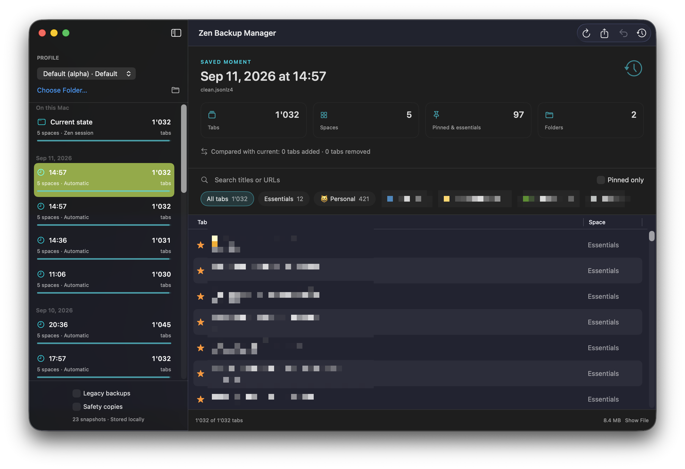

# Zen Backup Manager

A native macOS app for finding your way back to a previous Zen Browser session.
Browse a timeline of saved moments, inspect the tabs and spaces in each one, and
restore a backup with a verified safety copy and undo.

**Version: <!-- version -->0.1.0<!-- /version -->** · macOS 14 Sonoma or later · Apple Silicon and Intel

> [!IMPORTANT]
> LLM disclosure: This codebase was written with substantial help from large language models: AI coding agents working from the [`AGENTS.md`](AGENTS.md) brief in this repo.



## What it does

- Discovers Zen profiles from `profiles.ini`, including the installation's default
  profile. Custom profiles can be selected with **Choose Folder**.
- Displays current session files, automatic Zen backups, optional legacy Firefox
  backups, and this app's safety copies in a dated timeline.
- Shows tab counts, spaces, pinned tabs/essentials, folders, and a searchable tab
  table. Filter by space or pinned status; copy a tab URL from its context menu.
- Compares URL counts with the current saved session, including duplicate tabs.
- Restores modern sessions byte-for-byte, preserving metadata the app does not
  display, such as folders, split views, cookies within the session, and form data.
- Supports the documented legacy migration procedure for `sessionstore` backups.
- Saves the existing session files before restoring; **Undo Restore** returns to
  that exact saved state. Safety copies persist across launches.
- Exports the original compressed file, and reveals files in Finder.

No account, browser extension, Python, Homebrew runtime, or third-party Swift
package is needed. The only network feature is the shared GitHub update checker,
which can be disabled in Settings. Tab titles, URLs, and backup data stay local.

## Restore a session

1. Choose a profile and a backup from the timeline.
2. Review its tabs and the comparison with the current saved state.
3. Click **Restore…**. Quit Zen with ⌘Q, or use **Quit Zen** in the confirmation
   sheet. Resolve any download/close prompts Zen displays.
4. Click **Restore Backup**, then **Open Zen** after success.
5. To reverse it, quit Zen again and choose **Undo Restore** in the toolbar.

The comparison describes saved data at the last refresh; refresh after changing
or quitting Zen for the newest counts. Restoring a full snapshot also removes tabs
opened after that snapshot. The safety copy preserves the replaced session.
Legacy sessions can contain duplicate tabs across windows; previews count each
stored tab. An unreadable snapshot stays visible with an error and cannot be restored.

Safety copies live in:

```text
~/Library/Application Support/ZenBackupManager/Safety Copies/<UUID>/
```

Each contains the original `zen-sessions.jsonlz4` and/or `sessionstore.jsonlz4`, plus
an integrity manifest. Missing files are recorded as missing, so undo can restore
that state too. Copies are retained until you remove them yourself in Finder.
They contain private browsing/session data: treat them like the browser profile.
This is a session recovery tool, not a backup of bookmarks, extensions, passwords,
or the whole profile, and it does not schedule periodic backups itself.

## Build and run

Requires Xcode 16.2 or later. Open `ZenBackupManager.xcodeproj`, select the
**ZenBackupManager** scheme, and run. The project uses synchronized source groups.

With the shared [release-tool](https://github.com/L-K-M/release-tool) installed:

```bash
scripts/build.sh --run
scripts/build.sh --clean --zip --dmg
```

Or build without the shared tool:

```bash
xcodebuild -project ZenBackupManager.xcodeproj -scheme ZenBackupManager \
  -configuration Debug -derivedDataPath build CODE_SIGNING_ALLOWED=NO build
codesign --force --deep --sign - build/Build/Products/Debug/ZenBackupManager.app
open build/Build/Products/Debug/ZenBackupManager.app
```

## Tests

```bash
xcodebuild -project ZenBackupManager.xcodeproj -scheme ZenBackupManager \
  -destination 'platform=macOS' CODE_SIGNING_ALLOWED=NO test
```

Tests use synthetic compressed fixtures and temporary profiles, never your real
browser data. They cover decoding and corrupt files, history indexes, discovery,
URL comparisons, restoring modern/legacy files, undo, changed sources, symlinks,
private file permissions, and rollback after injected write failures.

## Distribution

The app is not sandboxed because it must read and replace files in Zen profiles.
Distribution is ad-hoc signed, not Developer ID signed or notarized.

## Implementation and recovery contract

See [PLAN.md](PLAN.md) for architecture, write boundaries, and limitations, and
[AGENTS.md](AGENTS.md) for contributor guidance.

The restoration paths follow [Zen's recovery documentation](https://docs.zen-browser.app/user-manual/window-sync).
The profile lock follows [Mozilla's macOS profile locking implementation](https://github.com/mozilla-firefox/firefox/blob/main/toolkit/profile/nsProfileLock.cpp).

An independent utility; not affiliated with Zen Browser or Mozilla.
